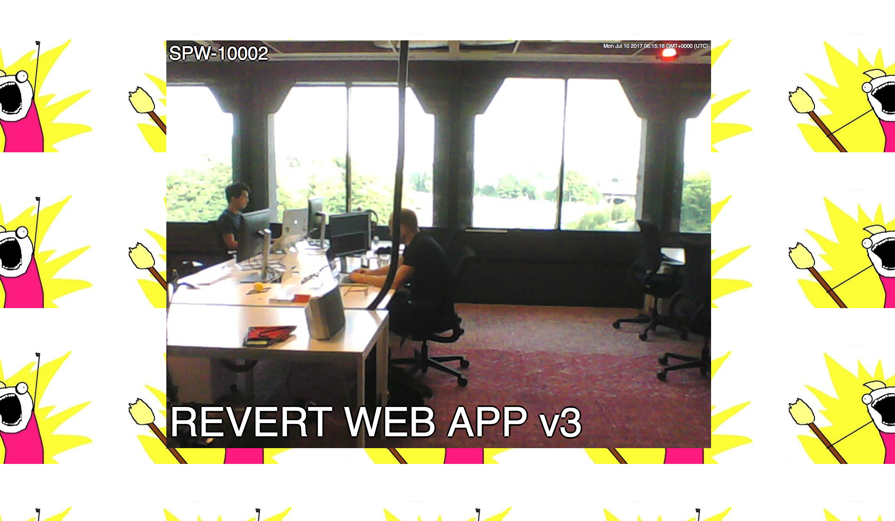

# SchnipShit
Ship it Snap Chat style

A tessel2 project. 
Configure JIRA to call the exposed webhook "jiraShipped" and snap a picture of the team each time something is shipped.

## Installation

`npm install`

`t2 push index.js`

